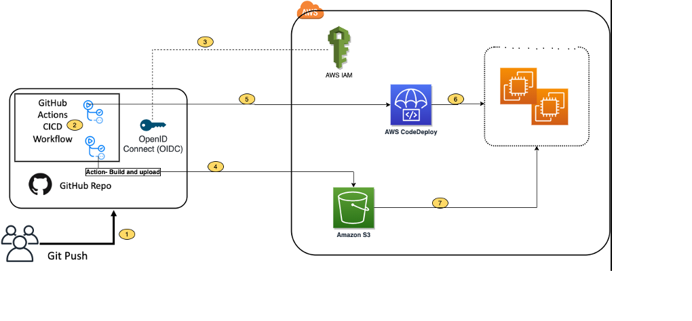

# pcshopwebsite
An online shopping website for PC parts

## Requirements
1. Product Discovery and Purchase:
Visitors can easily browse through a wide range of computers, explore product details, and make purchases without the need for registration.
2. Personalized Experience:
Registered users can create profiles, allowing them to personalize their preferences, track order history, and receive tailored recommendations.
3. Community Engagement:
Users can rate and review products, sharing their experiences and insights with the community to help others make informed decisions.
4. Efficient Shopping:
Customers can filter and sort products based on their preferences, allowing for quick and efficient product searches that match their specific needs.
5. Convenient Wishlist:
Users can create and manage a wishlist of favorite products, making it easy to save items for future reference or purchase.
6. Seamless Mobile Experience:
The website is designed with responsive and mobile-friendly features, ensuring a seamless experience across various devices and screen sizes.
7. Streamlined Admin Management:
Administrators have access to a dedicated dashboard for managing products, user accounts, orders, and inventory efficiently.
8. Data Security and Privacy:
Robust security measures are implemented to protect user information, ensuring compliance with privacy regulations and providing peace of mind to customers.
9. Business Insights and Performance Tracking:
The platform offers analytics and reporting features that provide valuable insights into sales trends, user behavior, and popular products, empowering data-driven decision-making.
## Other non-functional requirements to be considered:
11. Scalability and Flexibility:
The website is built with a scalable architecture that can be easily extended to support additional features and functionalities as the business grows.
## Testing requirements
1. Test Coverage: Ensure comprehensive test coverage for all critical functionalities and use cases of the backend service. This includes verifying the functionality of user registration, product listing, product details, cart management, order processing, and any other key features.

2. API Testing: Test the API endpoints thoroughly, including both positive and negative scenarios. Verify the correctness of request handling, response format, status codes, and data validation.

3. Integration Testing: Perform integration tests to validate the integration of various components, such as the database, external services (if any), and third-party APIs. Ensure smooth communication and proper functioning of these integrations.

4. Security Testing: Conduct security testing to identify and address potential vulnerabilities. Test for common security risks such as SQL injection, cross-site scripting (XSS), cross-site request forgery (CSRF), and authentication/authorization vulnerabilities.

5. Performance Testing: Validate the performance of the backend service by conducting load testing and stress testing. Ensure the system can handle the expected traffic and scale appropriately.

6. Data Integrity Testing: Verify the integrity of data operations, such as adding products, updating inventory, and processing orders. Ensure that the data remains consistent and accurate throughout the system.

7. Error Handling and Exception Testing: Test the service's error handling capabilities by simulating various error scenarios and exceptions. Ensure that appropriate error messages are returned to clients and logged for debugging purposes.

8. Continuous Integration and Deployment (CI/CD) Testing: Establish automated testing as part of the CI/CD pipeline. Run tests automatically on each code commit or deployment to catch regressions early and maintain the overall quality of the service.

9. Test Environments: Set up separate test environments that closely resemble the production environment to replicate real-world scenarios. This includes a dedicated test database, test data setup, and simulated user interactions.

10. Test Documentation: Maintain comprehensive test documentation, including test cases, test plans, and test data. This helps in ensuring consistency, collaboration among team members, and knowledge sharing.

11. Bug Tracking and Reporting: Utilize a bug tracking system to report and track any issues found during testing. Collaborate with the development team to address and resolve identified bugs promptly.

12. Frontend Testing: Test the user interface (UI) of the webshop by performing frontend testing. This includes testing the UI components, user interactions, and visual elements to ensure they are rendered correctly and function as expected.

13. End-to-End Testing: Conduct end-to-end testing to validate the flow and integration between the frontend and backend components. This involves simulating user actions and verifying that the entire application works seamlessly as a whole.

14. Cross-Browser and Cross-Device Testing: Test the application across different browsers and devices to ensure compatibility and responsiveness. Verify that the webshop functions correctly on popular browsers (e.g., Chrome, Firefox, Safari) and various devices (desktop, mobile, tablet).

15. Accessibility Testing: Perform accessibility testing to ensure that the webshop is accessible to users with disabilities. Verify compliance with accessibility guidelines (e.g., WCAG) and test features such as keyboard navigation, screen reader compatibility, and color contrast.

16. Performance and Scalability Testing: Validate the performance and scalability of the application under different load conditions. Conduct performance testing to measure response times, resource utilization, and system stability. Ensure that the application can handle increased traffic and scale effectively.

17. Security Testing: Perform comprehensive security testing to identify and address potential vulnerabilities. Test for common security risks such as cross-site scripting (XSS), cross-site request forgery (CSRF), session management, input validation, and data encryption. Conduct penetration testing to identify any weaknesses in the application's security defenses.

18. Usability and User Acceptance Testing: Collaborate with end-users or a focus group to conduct usability and user acceptance testing. Gather feedback on the user experience, navigation, and overall satisfaction with the webshop. Use this feedback to make necessary improvements and ensure a user-friendly interface.

19. Integration and System Testing: Test the integration between the webshop application and any external systems, such as payment gateways, shipping providers, or inventory management systems. Validate that data flows correctly between systems and that the overall functionality is maintained.

20. Regression Testing: Perform regression testing whenever changes or updates are made to the application. This ensures that existing features and functionalities remain unaffected by new changes and that any bugs or regressions are caught early.

21. Continuous Testing and Automation: Implement a robust and automated testing framework as part of your continuous integration and deployment (CI/CD) pipeline. Automate the execution of tests to ensure consistent and reliable results with each code change or deployment.

22. Documentation and Reporting: Maintain comprehensive documentation of test cases, test scenarios, and test results. Report and track issues using a bug tracking system. Document the testing process, including methodologies used, test coverage, and any identified risks or areas for improvement.
## Future thoughts:
11. Search Engine Optimization:
12. Social Media Integration:
13. Payment Gateway Integration:
14. Shipping Integration:
## Work packages:
### Package 1.1 - Product Discovery and Purchase:
### Package 1.2 - Efficient Shopping:
### Package 1.3 - Seamless Mobile Experience:
### Package 2.1 - Personalized Experience:
### Package 2.2 - Community Engagement:
### Package 2.3 - Convenient Wishlist:
### Package 3.1 - Streamlined Admin Management:
### Package 3.2 - Data Security and Privacy:
### Package 3.3 - Business Insights and Performance Tracking:
## Package 1.1 - Product Discovery and Purchase:
### Information architect - Desktop
- Home Page:
Header: Place your website logo, navigation menu, search bar, and user login/register links in the header section.
Hero section: Highlight new products, promotions, or featured content to attract visitors' attention and encourage product exploration.
Product listings: Display a grid or list of computer products on the home page, showcasing essential details such as product images, names, prices, and ratings.
Footer: Include links to important pages such as contact information, about us, terms of service, and social media links.
- Computer Listing Page:
Header and navigation: Maintain consistent placement of the header and navigation elements from the home page.
Filters: Position the filters on the left or right sidebar to allow users to refine their product search by category, price range, brand, or specifications.
Product grid: Display computer products in a visually appealing grid format, ensuring that each product card includes an image, name, price, and rating.
Pagination or infinite scrolling: Implement an appropriate mechanism to allow users to navigate through multiple pages of products.
Sort options: Add a dropdown or buttons to enable users to sort products by price, name, or rating. Place this above or near the product listings.
- Computer Detail Page:
Header and navigation: Maintain consistent placement of the header and navigation elements from the previous pages.
Product image gallery: Place high-quality product images prominently, allowing users to view the computer from multiple angles or in a carousel format.
Product details: Position the product name, price, description, and specifications below the product image gallery, providing users with comprehensive information about the computer.
User reviews and ratings: Display customer reviews and ratings below the product details to help users make informed purchase decisions.
Add to Cart button: Position the "Add to Cart" button prominently, preferably above the fold, allowing users to add the computer to their cart easily.
- Cart and Checkout Process:
Cart page: Display a summary of the selected computer(s) in the cart, including product details, quantities, and prices. Provide options to update quantities or remove items from the cart.
Checkout page: Position the steps for shipping information, payment details, and order confirmation logically, guiding users through the checkout process smoothly.
Order summary: Display a comprehensive order summary, including product details, quantities, totals, applied discounts, and a prominent "Place Order" button.
### Information architect - Mobile
For mobile devices, you may consider the following adjustments:

- Home Page:
Ensure that the header, search bar, and navigation menu are condensed and easily accessible in a mobile-friendly format, such as a hamburger menu.
Optimize the placement and size of the hero section to fit the smaller screen, focusing on key promotions or featured products.
- Computer Listing Page:
Make sure the filters are collapsible or placed in an expandable accordion format to save screen space.
Consider using a vertical scrolling layout for the product grid to accommodate smaller screens.
- Computer Detail Page:
Optimize the layout of the product image gallery for smaller screens, ensuring that users can swipe or tap to view different images.
Arrange the product details, reviews, and ratings in a vertical format for easy scrolling.
- Cart and Checkout Process:
Simplify the cart page by condensing information and using collapsible sections if necessary.
Streamline the checkout steps, displaying one step at a time to avoid overwhelming the user on smaller screens.

### CI/CD architect/flow
